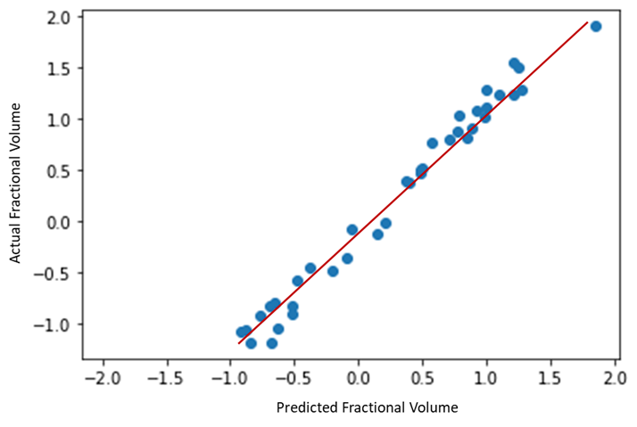
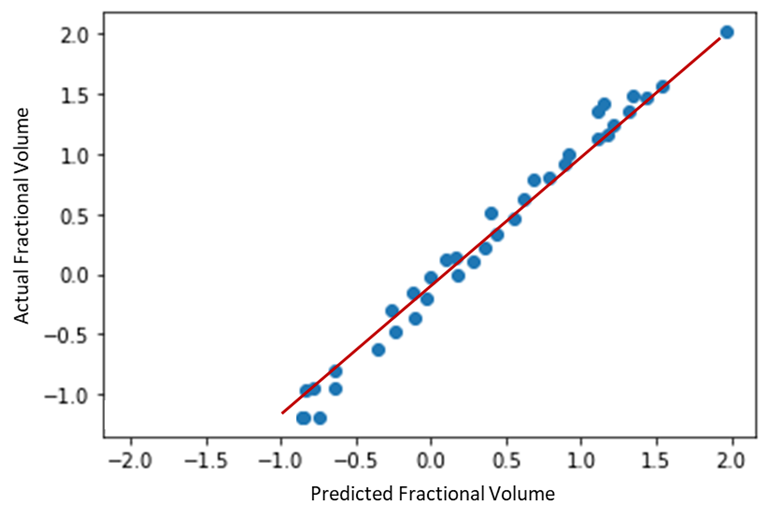

# **Gas Hydrates Risk Management System**

 This study presents a data-driven gas hydrate diagnosis model for monitoring and risk evaluation in gas pipelines by performing, hydrate growth rate diagnosis for flow assurance in gas-dominated flow systems. Data used for learning was obtained from hydrate flow loop experiments performed under controlled gas-dominated flow conditions where thermodynamic conditions were obtained at each time step. Regression Algorithms were applied to develop a fit for a model to predict the hydrate risk level given thermodynamic conditions alongside the flowrate. The developed hydrate model was also applied to study the performance in flow operations. 
 
 - To see a summary of this project in a presentation forat, please go [here](https://github.com/BasseyIsrael/Gas-Hydrates-Risk-Management-System/blob/main/Gas%20Hydrates%20Risk%20Management%20Presentation.pdf)
 - You can also find a live video presentation of the project [here](https://drive.google.com/file/d/1Gl0rFusDxp3lEE67mhE1le8K0RyWp8oZ/view?usp=sharing)
 
 Use this readme file to understand the project and the results obtained. If you would like to collaborate on a data-based related project, you can contact me on israelbssy@gmail.com.
 

For the Badges [source](https://shields.io/)

## **Author(s)**

- [Dr. Toyin Odutola](https://ng.linkedin.com/in/toyin-odutola-phd-r-engr-a31653b)
- [Israel Bassey](https://github.com/BasseyIsrael)
- [Anita Igbine](https://ng.linkedin.com/in/anita-igbine-0a4282150)
- [Celestine Udim Monday]()

## **Table of Contents**

  - [Introduction & Project Problem](#introduction--project-problem)
  - [Source of Data](#source-of-data)
  - [Methods Applied](#methods-applied)
  - [Quick Glance at Key Results](#quick-glance-at-key-results)
  - [Limitation and Improvement Opportunities](#limitations-and-improvement-opportunities)
  - [Explore Notebook](#explore-notebook)
  - [Contribution](#contribution)

# **Introduction & Project Problem**

Gas hydrates are ice-like clathrates composed of gas (guest molecules) trapped in water (host molecules). Hydrates form in conditions of high pressure (typically above 30 bar) and low temperature (below 20°C), though the precise pressure and temperature conditions for the formation of hydrates depend on the composition of the fluids. The guest molecules in hydrates are methane, ethane, propane, isobutane, and non-hydrocarbon gases (CO2, H2S, or N2).

Gas hydrates pose a problem in drilling and can be catastrophic when encountered in the formation. Gas hydrates can form when drilling into shallow sediments with gas or when mud circulation is stopped, resulting in gas kick during drilling. Hydrates can cause well control problems when they solidify and choke the well or kill lines. Hydrates can also form in risers and drill string stopping the circulation of drilling fluid, leading to stuck pipe (Sami, 2013). One major problem with hydrates is that they can form anywhere under the right conditions. 

Gas hydrate deposition can lead to the reduction of the internal diameter of flow lines and cause flow restrictions, increased surface roughness, increased pumping pressure, and reduced throughput. In severe cases, hydrates can plug off flow lines and result in production losses and production shut down 

This project focuses on the use of machine learning algorithms for hydrate risk management in gas dominated flow systems. The models developed depend on the relationship between flowrate, temperature, and pressure to determine the fractional hydrate growth rate on a gas dominated flow system.

# **Source of Data**

To establish a relationship between the flowrate, temperature and pressure conditions, and the hydrate film growth fraction, an experiment was prepared with a hydrate flow loop. The experiments were performed under five (5) flowrate conditions, and data was obtained for each of these conditions. The volume of effluent, hydrate start time, temperature, and pressure were measured for each experimental run. 

The data is not provided is this repository to ensure anonimity, and reduce data exploitation. You can contact me on israelbssy@gmail.com if you have any needs for the data used.

The data obtained from the experiment was used in the machine learning predictive model development following data manipulation and conditioning.

# **Methods Applied**

The methods applied for this project exists in two stages. The first stage involved the experimentation and extraction of data to help in building the predictive model. The second stage involves the development of the predictive models. 

The accumulation of hydrate in a gas dominated flow system involves the development of film on the inner section of the pipe wall. Beyond the basic predictions of hydrate formation conditions, and hydrate occurrence in a gas flow system for risk management, it is necessary to determine the fractional hydrate development at specific conditions in a flowline which can be utilized for various forms of sensitivity analysis, design constraints, and inhibition administration control. From the experiment performed, the occurrence conditions (time, temperature, pressure) for each flowrate were obtained. 

A growth assumption was made for the hydrate formation conditions using the volume of effluent obtained at the end of the experiment, and the volume administered at the start of the experiment. The rate of growth of the hydrate in the flow loop was assumed to be constant, and the fractional hydrate formation at each time step of the experiment was computed.

The predictive algorithms used in this project are 

1.	Linear Regression (Multivariate)
2.	Ridge Regression
3.	Light Gradient Boosting Machine (LGBM)

The regression algorithms were selected based on the simplicity of the dataset obtained and to reduce complexities in remodeling the data for further analysis and development. 

For the development of the Ridge Regression, 13 alphas were tested to determine the optimum weighting to be used for the model development and training. A cross validation was performed on each iteration to determine the performance after changes on each alpha. The mean squared error was used as the error metric for the computation. In developing the model, a Stochastic Average Gradient Descent was used as the solver for the model. It used an iterative process that uses a random sample of previous gradient values for its optimization. The alphas for each iteration were obtained and the best was selected to fit the model.
To develop the LGBM model, the root mean squared error was used for scoring in the selection of the hyperparameters. The parameters were obtained using an iteration based on python’s random generation modules. The model was fit based on the optimum values obtained from the process, and training was performed.

The mean squared error and the R-Squared values were used to test the performance of the models developed with the three algorithms.

# **Quick Glance at Key Results**

To model the relationship between the hydrate formation and the flow rate, a plot was created between the flow rate and the volume of effluent obtained at the end of the experiments based on a 1500 ml initial volume.  The plot shows that there is a direct relationship between hydrates formation and flow rate in gas-dominated flow systems. 

To get a closer look at this relationship, a developed boxplot is presented. The boxplot shows the relationship between the Percentage hydrate formation and the Flowrate showing distribution changes (increase) as the flowrate increases.

In the exploratory data analysis, a correlation plot was obtained to observe the relationship among the variables. The plot shows the correlation relationship of the variables among each other. A correlation plot was created for the initial variables from experimentation and another plot was created after the variables used for the model development were selected.

Correlation plot before data transformation with multicolinearity problems.

Correlation Plot of Variables Selected after Data Analysis and transformation

A poor correlation is observed between the flowrate and the percentage formation because of the count of distinct values existing between the two variables. Based on knowledge of data analysis, it was assumed that that the flowrate will only properly correlate with the percentage formation if it is used alongside other variables with distinctive values during modelling. 

From further analysis of the data, univariate distribution analysis was performed on the target variable to determine if actions need to be taken on the dataset.

The plot shows that the system is heavily skewed at zero, and evenly distributed between 0.1 and 0.4. This distribution has the tendency to yield errors when fitted to a model.

To prove this, the image below is a performance plot when the original data is used to fit the regression model.

 To handle this issue, a smoothing method was employed. The method employed was standardization.

With the prepared data, performance of the models we checked with performance plots and metrics. The plots and metrics are presented.

**Cross Correlation Plot of Predicted Fractional Volume with the Actual Fractional Volume Showing the performance of the Ridge Regression Hydrate Risk Level Analysis Model.**

**Cross Correlation Plot of Predicted Fractional Volume with the Actual Fractional Volume Showing the performance of the Linear Regression Hydrate Risk Level Analysis Model**

**Cross Correlation Plot of Predicted Fractional Volume with the Actual Fractional Volume Showing the performance of the Light Gradient Boosting Machine Hydrate Risk Level Analysis Model**

Giving more insights on the performance, a table showing the root mean squared error and coefficient of determination is also presented. 

The regression algorithms are able to adopt the trend and properly make predictions on the hydrate associated risk level following the data pre processing methods employed with the ridge regression yeilding the lowest error and beinig able to best explain the model at 95% R-Squared value.  

# **Limitations and Improvement Opportunities**

- Adopting more advanced algorithms to ensure a more robust modelling an dprediction.
- Go beyond experimental data to using realtime field data to improve the prediction range.

# **Explore Notebook**

- [Hydrate Prediction Analysis Noteboook](https://nbviewer.org/github/BasseyIsrael/Stock-Assets-Prediction/blob/main/src/A-%20Feature%20Extraction%20with%20Technical%20indicators.ipynb)

## **Contribution**

Pull requests are welcome! For major changes, please open an issue first to discuss what you would like to change or contribute.